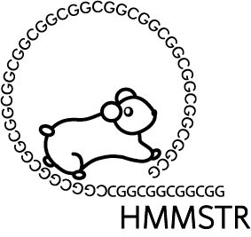
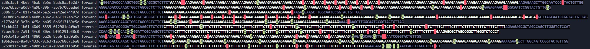
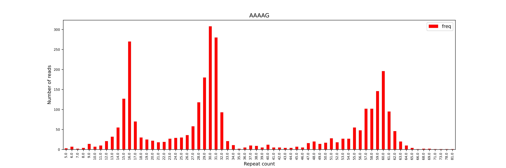
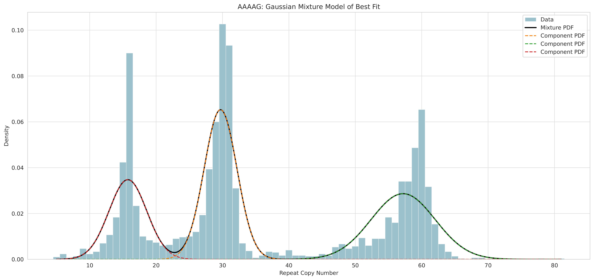
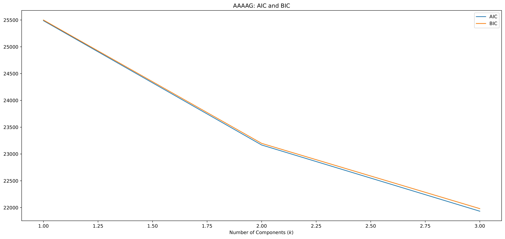
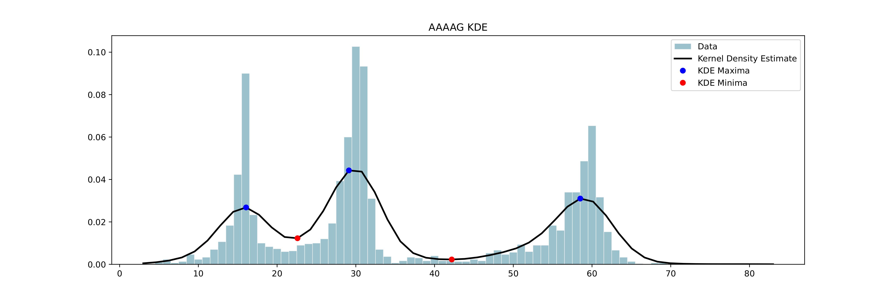
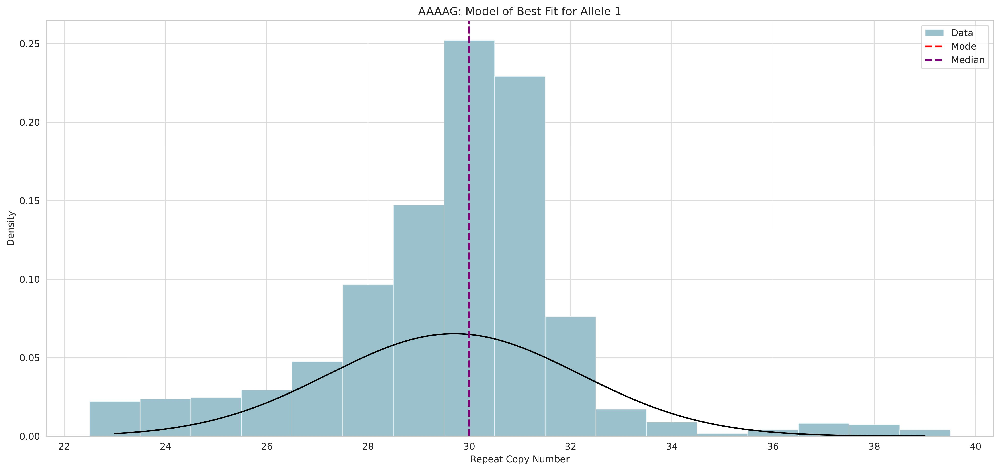
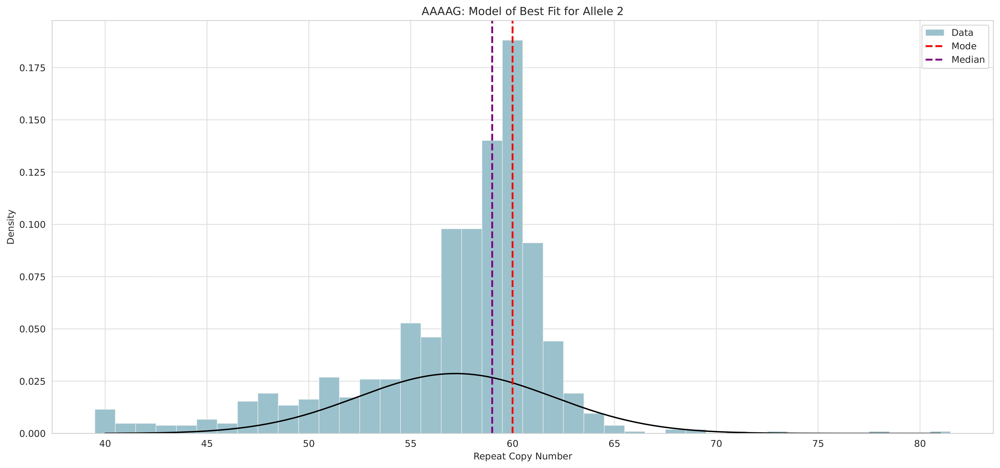
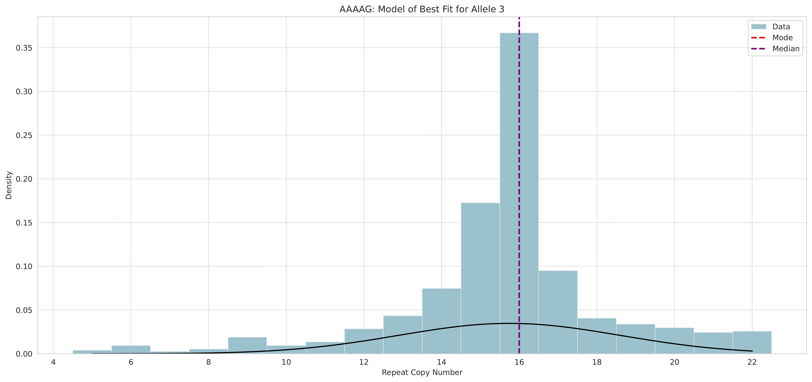

# HMMSTR
<picture>
  <source media="(prefers-color-scheme: dark)" srcset="images/hmmstr_white_fill_360.png">
  
</picture>

## A modified profile HMM for tandem repeat copy-number determination from long-reads
HMMSTR calls tandem repeat copy number from raw, long-read, sequencing reads and reports copy numbers in both a read and sample specific format. While designed to model Nanopore sequencing errors in repetitive regions, HMMSTR can be applied to PacBio data as well and has flexible arguments to allow for custom error rates.

HMMSTR is optimized for targeted sequencing experiments and can be run with a single or multiple target regions/sequences in a global-alignment and reference free format.

## Dependencies
* Python >= 3.8
* colorama
* numpy
* pandas
* pickleshare
* scikit-learn
* scipy
* seaborn
* importlib-resources
* mappy

* glib-2 (Ubuntu install command below)
  ```
  sudo apt install libglib2.0-dev
  ```

## Installation
HMMSTR is currently available on Pypi
```
pip install HMMSTR
```

## Usage
```
usage: hmmstr [-h] [--output_plots] [--output_labelled_seqs] [--max_peaks MAX_PEAKS] [--cpus CPUS] [--flanking_size FLANKING_SIZE] [--mode MODE] [--mapq_cutoff MAPQ_CUTOFF] [--k K] [--w W] [--use_full_read] [--peakcalling_method PEAKCALLING_METHOD] [--bandwidth BANDWIDTH] [--kernel KERNEL] [--bootstrap] [--call_width CALL_WIDTH] [--resample_size RESAMPLE_SIZE] [--allele_specific_CIs] [--allele_specific_plots]
              [--discard_outliers] [--filter_quantile FILTER_QUANTILE] [--flanking_like_filter] [--stranded_report] [--cluster_only] [--save_intermediates] [--background BACKGROUND] [--E_probs E_PROBS] [--A_probs A_PROBS] [--custom_RM CUSTOM_RM] [--hmm_pre HMM_PRE]
              {targets_tsv,coordinates} ... out inFile
```

HMMSTR has 2 input modes:
#### [targets_tsv](examples/example_input.tsv)

Directly uses an input tsv with the following columns:
1. `name`: the names of all targets for a given run
2. `prefix`: the sequence directly upstream of the target repeat (200bp recommended)
3. `repeat`: repeat motif for given target (must be on the same strand as prefix and suffix sequences)
4. `suffix`: the sequence directly downstream of the target repeat (200bp recommended)
    
#### [coordinates](panel_target_inputs/final_daTR_coords_disease_abb.txt)

Uses a custom bedfile to create the targets tsv from the following columns:
1. `Chromosomes`
2. `Start coordinate`
3. `End coordinate`
4. `Repeat motif`(on same strand as reference genome used)
5. `Target name` (optional, if not given name will be assigned as chr:start-end)

coordinates also requires the following additional positional arguments:
1. `chrom_sizes`: path to chromosome sizes file corresponding to the reference genome used
2. `ref`: path to the reference genome to get flanking sequences from
3. `input_flank_length`: Length of the prefix and suffix to get from the reference genome, must be longer than 100bp (Default) or the ```--flanking_size``` optional parameter, (optional, default: 200)


Optionally, the user may also input all options as a text file which each input parameter and option on its own line. An example of this can be found [here](examples/multi_test_run_input.txt). This file is also automatically output to [out_prefix]_run_input.txt as a record of the run.
### Required Positional Arguments
|  Argument &nbsp; &nbsp; &nbsp; | Description |
|---|---|
|out| Path to output directory with prefix for all results in this run|
|inFile| Sequence file in fasta or fastq format, can be gzipped (must end with .gz)|
<details>
  <summary> Optional Arguments </summary>
  
### Optional Arguments
| Argument &nbsp; &nbsp; &nbsp; &nbsp; &nbsp; &nbsp; &nbsp; &nbsp; &nbsp; &nbsp; &nbsp; &nbsp; &nbsp; &nbsp; &nbsp;| Description |
|---|---|
|--cpus| Maximum number of CPUs to use during read processing step (default: half of available CPUs)|
|--use_full_read| If passed, HMMSTR will use the full read sequence to predict copy number instead of subsetting each read based on flanking sequence alignment. Optimal for runs where the repeat is close to the end or start of the reads consistently (ie when running on PCR products where primers are relatively close to the repeat of interest)|


### Model Size
|  Argument &nbsp; &nbsp; &nbsp; &nbsp; &nbsp; &nbsp;  &nbsp; &nbsp; &nbsp;  &nbsp; &nbsp; &nbsp;| Description |
|---|---|
|--flanking_size| Integer designating the number of bases flanking the repeat to encode in the model. Must be shorter or equal in length to given prefix and suffix. Note: significant increases in flanking size will increase runtime but may increase accuracy in low complexity regions. Longer flanking sequences are recommended for regions with high similarity with respect to sequence directly flanking the repeat (default: 100, 100-200 recommended for highly repetitive regions, 30 for increased speed)|


### Alignment Options
|  Argument &nbsp; &nbsp; &nbsp; | Description |
|---|---|
|--mode| Mode used by mappy. map-ont (Nanopore), pb (PacBio), or sr (short accurate reads, use for short flanking sequence input) (default: map-ont)|
|--mapq_cutoff| MapQ cutoff for prefix and suffix (default: 30, range: 0-60)|

### Peak-calling Options
|  Argument &nbsp; &nbsp; &nbsp; &nbsp; &nbsp; &nbsp; &nbsp; &nbsp; &nbsp; &nbsp; &nbsp; &nbsp;| Description |
|---|---|
|--max_peaks| Integer designating the maximum number of alleles to call for a given run (default: 2)|
|--peakcalling_method| Used to override the default peak calling pipeline. Options include: gmm, kde, kde_throw_outliers (default:auto, HMMSTR chooses the best method based on the distribution of copy numbers per target)|
|--discard_outliers| If passed, outliers per read-level copy number will be discarded based on quantile. If ```--filter_quantile``` not set, reads exceding the top and bottom quantile (0.25) will be discarded and marked as outliers in outputs|
|--filter_quantile| Float designating quantile of count frequency to discard when filtering outliers (default: 0.25)
|--flanking_like_filter| If passed, outliers determined by the likelihood of the flanking sequence will be filtered. This is an additional filter for off-targets or low quality reads|

#### KDE Options
|  Argument &nbsp; &nbsp; &nbsp; | Description |
|---|---|
| --bandwidth | Bandwidth to use for KDE. It is recommended to use the default scott method, especially when there is no expectation for the distribution of repeat lengths.|
| --kernel | Kernel to use for the KDE. Default is gaussian, allows for other kernels if testing different distributions is desired.|


### Output Options
|  Argument &nbsp; &nbsp; &nbsp; | Description |
|---|---|
| --output_plots | output supporting reads histogram showing how many reads were assigned to each repeat copy number per target in a single run as well as the model of best fit|
| --bootstrap | Boolean designating to output bootstraped confidence intervals for allele calls. By default, the samples are drawn from the full dataset regardless of allele.|
| --output_labelled_seqs | Output the model path through prefix, repeat, and suffix identified per read as context_labelled.txt per target. This is useful for inspecting repeat sequences as well as how well your model fit your target of interest.|
| --stranded_report | If set, genotypes are called for each strand separately and strand bias is reported if found.|

#### Bootstrapping Options
|  Argument &nbsp; &nbsp; &nbsp;  &nbsp; &nbsp; &nbsp; &nbsp; &nbsp; &nbsp;| Description |
|---|---|
|--call_width| Decimal percentage designating confidence interval width to calculate in bootstrapping (default: 0.95)|
|--resample_size| Number of times to resample the repeat copy number distribution during bootstrapping (default:100)|
|--allele_specific_CIs| Output allele-specific bootstrapped confidence intervals. This process separates data by assigned alleles before sampling.|
|--allele_specific_plots| Output allele-specific histograms with model of best fit. Helpful when visualizing alleles with significantly different support|
</details>
<details>
<summary> Advanced Options </summary>
  
### Advanced Options
#### Custom Model Parameter Options
Optional tsv inputs to set custom model parameters.
|  Argument &nbsp; &nbsp; &nbsp; | Description |
|---|---|
|--background| TSV with custom background frequencies to encode in genome states (example [here](examples/custom_background_example.txt)|
|--E_probs| TSV with custom emission probabilities to be encoded in match states. These should correspond to the expected mismatch rate (example [here](examples/custom_emission_example.txt))|
|--A_probs| TSV with custom transition probibilities to be encoded in the model. Column names in "P_xy" format such that 'x' is the first state type and 'y' is the state type 'x' transitions to (example [here](examples/custom_transitions_example.txt))|
|--custom_RM| TSV with columns corresponding to a given postion in the repeat motif and rows corresponding to possible nucleotides (and deletion character ''). This is used to designate custom nucleotide occupancy per position in a given motif in case of known mosaicism (ie AAGGG vs AAAAG at the CANVAS locus). Note: this matrix will be applied to all models in a given run, it is advised you only use it in single target runs (example [here](examples/custom_RM_example.txt))|

#### Advanced Alignment Options
Parameters to pass to Mappy during alignment step
|  Argument &nbsp; &nbsp; &nbsp; | Description |
|---|---|
|--k| Integer designating kmer parameter to be passed to mappy (see mappy documentation)|
|--w| Window parameter to be passed to mappy (see mappy documentation)|

#### Debug Options
Parameters to use to test different clustering methods on your data
|  Argument &nbsp; &nbsp; &nbsp; | Description |
|---|---|
| --save_intermediates | Flag designating to save intermediate files including model inputs, raw count files, and state sequence files. NOTE: raw count files are required to recall alleles without rerunning the counting algorithm, see ```--cluster_only```|
| --cluster_only | Only run peak calling step on existing raw repeat copy counts data ```'out''target_name'_counts.txt```. NOTE: Must use the same output and target names as the run that produced the counts files.|
</details>

<details>
  <summary> Output File Details </summary>

  ### Output File Details
  There are two tsv files output by HMMSTR by default, a description of the columns included in both are as follows:
  #### [*_genotype_calls.tsv](examples/example_genotype_calls.tsv)
  This file has one row per target in the given input
  1. `name`: name of the target designated by input
  2. `A1:median`: median repeat copy number of allele one
  3. `A1:mode` : mode repeat copy number of allele one
  4. `A1:SD` : standard deviation of the allele one cluster
  5. `A1:supporting_reads` : the number of reads assigned to allele 1
  6. `num_supporting_reads`: total number of reads assigned to any allele
  7. `bandwidth`: if KDE was used for peak calling, the bandwidth selected will display here, otherwise it is set to -1.0
  8. `peak_calling_method`: which peak caller was used for a given target

  Note: All allele specific columns will repeat up to the `max_peaks` parameter set by input

  #### [*read_assignments.tsv](examples/example_read_assignments.tsv)
  This file has one row for every target a given read was assigned to, thus if a read is assigned to multiple targets it will show up multiple times
  1. `name`: name of target given read was assigned to
  2. `read_id`: id of the read
  3. `strand`: the strand of the read relative to the input sequence or reference
  4. `align_score`: combined mapq of prefix and suffix sequences
  5. `neg_log_likelihood`: the negative-log-likelihood of the Viterbi path the read takes through the target model. Note: this is for the subsetted read in the default case, not the full read sequence
  6. `subset_liekihood`: the negative-log-likelihood of the sequence labelled as prefix, repeat, and suffix states
  7. `repeat_likelihood`: the negative-log-likelihood of the identified repeat sequence
  8. `repeat_start`: the start index of the repeat relative to the full input read string
  9. `repeat_start`: the end index of the repeat relative to the full input read string
  10. `align_start`: the start index of the start of the upstream alignment (either prefix or suffix dependent on the strand)
  11. `align_end`: the end index of the end of the downstream alignment (either prefix or suffix dependent on the strand)
  12. `counts`: the number of repeat copies called in the given read
  13. `freq`: the frequency of the copy number for the assigned target
  14. `cluster_assignments`: which allele the given read was assigned to during peak calling
  15. `outlier`: boolean designating if the given read was discarded before peak calling due to exceeding the IQR of the data (if applicable, will always be False if --discard_outliers not passed)
  16. `peak_calling_method`: the peak calling method used to assign the read to its allele

  </details>

## Example Use Cases
<details>
  <summary> Basic Use: Single Plasmid Target </summary>
  
### Basic Use: Single Plasmid Target
Here, we run HMMSTR on a sequence file containing nanopore reads from a plasmid construct with variable copies of an AAAAG repeat motif. Since these are plasmid contructs, we wrote our input tsv file [AAAAG_input.txt](tests/AAAAG_input.txt) by setting the prefix column to the 200bp upstream sequnce directly flanking the AAAAG repeat from the known backbone sequence and set the suffix column with the downstream flanking sequence. For this example, we will use all default parameters with the exception of ```--output_plots```, ```--max_peaks```, and ```--output_labelled_seqs```.
```
hmmstr targets_tsv AAAAG_input.txt ./tutorial_1 AAAAG_11012021_3000_sample.fasta --max_peaks 3 --output_plots --output_labelled_seqs
```
##### Default Outputs
1. ```tutorial_1_genotype_calls.tsv```: TSV containing final allele calls per target
2. ```tutorial_1_read_assignments.tsv```: TSV containing read level statistics and coordinates, copy number predictions, and allele assignments
3. ```tutorial_1_run_parameters.txt```: Text file with all parameters used in the run in "parameter : value" format including default values.
4. ```tutorial_1_run_input.txt```: Text file with all inputs in the format compatible with running HMMSTR with a file input, that is, one input parameter per line in the same format as the command line version. This file can be used to reproduce the run or used as a record of the run.

##### Optional Outputs
The following are output to a directory with suffix "_labelled_seqs
1. ```AAAAG_context_labeled.txt```: (Optional) Text file contianing repeat sequence and flanking context sequence colored by the optimal state path along with the read name and strand. This can be viewed on the command line. This is helpful when determining if the prefix/suffix you inputted are well fit to the repeat of interest and can help in debugging your inputs. This file is produced for each input target.

The following are output to a directory with suffix "_plots"
1. ```tutorial_1AAAAGpeaks.pdf```: (Optional) Supporting read histogram displayed with the model of best fit as a density plot -- GMM or KDE depending on the peak caller chosen.
2. ```tutorial_1AAAAGAIC_BIC.pdf```: (Optional) If GMM chosen, the AIC and BIC are plot and outputted here. These metrics are used to determine the most likely number of clusters.
3. ```tutorial_1AAAAG_supporting_reads_hist.pdf```: (Optional) Raw supporting read histogram, copy number by number of supporting reads.

Below is an example of the *context_labeled.txt files:

* Red rectangles represent deletions, green represents insertions, bases labeled as in the repeat sequence are white and the prefix and suffix are in grey

#### The following plots are produced by the given command:

Supporting read histogram

Model of best fit -- GMM

AIC/BIC plot


If the same command is run with the KDE ```--peakcalling_method``` option, the model of best fit plot would be the following:
```
hmmstr targets_tsv AAAAG_input.txt ./tutorial_1 AAAAG_11012021_3000_sample.fasta --max_peaks 3 --output_plots --peakcalling_method kde
```


### Including allele specific output plots and confidence intervals
HMMSTR also includes options to visualize per-read copy number prediction distributions in an allele-specific format. Below is how we would use HMMSTR to output these plots as well as allele-specific confidence intervals. Note: these confidence intervals are produced by bootstrapping the median of a given allele with 100 resamples.
```
hmmstr targets_tsv AAAAG_input.txt ./tutorial_1 AAAAG_11012021_3000_sample.fasta --output_plots --max_peaks 3 --bootstrap --resample_size 100 --allele_specific_CIs --allele_specific_plots
```
Allele 1           |  Allele 2           |  Allele 3
:-------------------------:|:-------------------------:|:-------------------------:
  |    |  
(30.0, 30.0) | (58.0, 59.0) | (16.0, 16.0)

 </details>
 <details>
   <summary> Repeat Expansion Panel </summary>
   
   ### Repeat Expansion Panel
   HMMSTR was designed as a companion tandem repeat caller for our repeat expansion panel as described in our manuscript (<- link). While HMMSTR performs optimally at a 100bp prefix and suffix model across all targets, in practice some targets do have more optimal model sizes based on their sequence context. For this reason, we provide [input target files](panel_target_inputs) (both coordinates and tsv inputs) separated by optimal model sizes. Below is an example of how to run one set of our targets (targets with 100bp flanking sequence model as their optimal model) in ```coordinates```.

   Run with ```coordinates``` input and all default parameters except ```--mapq_cutoff``` (we want to be strict with reads we accept)
   ```
hmmstr coordinates $TARGET_COORDS_100bp $CHR_SIZES $REF $OUT_100bp $INFILE --mapq_cutoff 60
  ```
This run will also produce the accompanying input file for future ```target_tsv``` runs under the output directory and prefix as ```_inputs.tsv```

One caveat you may run into is exceedingly low (1-2 reads) or unbalanced coverage across expanded alleles in an expansion positive sample. In this case, HMMSTR may discard the expanded allele if either ```--discard_outliers``` or ```--peakcalling_method kde_throw_outliers``` are passed. To account for this, it is recommended that in these cases you do not use either of these modes but rather override the default peak caller as follows:
```
hmmstr coordinates $TARGET_COORDS_100bp $CHR_SIZES $REF $OUT_100bp $INFILE --mapq_cutoff 60 --peakcalling_method gmm
```
This will ensure the entire dataset is considered during genotyping. Note: this will also result in an increase of false heterozygous calls for homozygous regions. If you wish to have high accuracy for both expanded alleles and homozygotes, consider running HMMSTR with both settings on the same sequence file.

If there is sufficient coverage across all alleles in the run, this is not an issue.
   
 </details>

 <details>
<summary>
  FAQs and Common Use Cases
</summary>
   
1. Why use one peak calling method over another?
   - Auto (default): The default peak caller will automatically designate a method per target based on the distribution of the data. This assumes that you have enough coverage across all alleles.
   - KDE: The Kernel Density peakcaller differentiates heterozygous and homozygous alleles better than the GMM peak caller; however, it is more easily skewed by outliers if used without discarding outliers. KDE is also better at separating data into independent distributions in cases with high noise.
   - GMM: The Gaussian mixture model peakcaller is more robust to outliers and uneven coverage across alleles. We recommend this option be used if you want higher sensitivity to detecting expanded alleles at low coverage and are less concerned about resolving heterozygous vs homozygous alleles with low copy number separation.
2. Median vs mode allele calls:
   - HMMSTR reports both the mode and median of the allele distribution. We report both because depending on the distribution of your data, one may be more accurate. As a general rule of thumb, the mode call will be more accurate at higher depths (>30x coverage per allele) while the median will be more accurate and consistent at lower coverage. Usually these metrics will be very similar if not the same, however if there is a significant difference, consider checking the supporting read histogram to make a more informed decision.
4. Can I run HMMSTR on PCR-amplified data?
   - Yes! Depending on the location of the primers used in the experiment, you may need to adjust HMMSTR parameters to account for short flanking sequence. To account for this, we have used these parameters in our analysis of amplicon data:
   ``` 
   hmmstr targets_tsv [Input tsv] [Output prefix] [Infile] --mapq_cutoff 0 --mode sr --k 6 --w 2 --use_full_read --flanking_size 50
   ```
6. Can I run HMMSTR on whole genome sequencing data?
   - HMMSTR is designed for targeted sequencing data and is not optimized for WGS data. However, if you would like to use HMMSTR to genotype specific targets from a WGS dataset we recommend you subset your dataset to only include regions of interest using ``` samtools view ``` then converting the reads back to fasta or fastq format. This will improve the specificity and runtime of the genotyping.
7. How can I call copy number estimates from non-spanning/soft clip reads?
   - While a core requirement of the HMMSTR algorithm is detecting unique flanking sequence, you can obtain copy number estimates from soft clipped reads using HMMSTR following our methods in our manuscript. Put briefly, you can arrange your inputs to target one flanking region and allow the second flanking region to end in the expected repeat. Note that this procedure will yield a rough estimate and we do plan to incorporate a more rigorous mode for non-spanning read estimates in future iterations.
8. Can I use HMMSTR to recover motif composition?
   - HMMSTR does not currently concurrently derive motif composition, however it can be used in conjunction with other motif decomposition softwares and we do so in our in-house processing pipeline. HMMSTR returns the position of the tandem repeat in each read as well as per-read allele assignments which allows for downstream analysis on the repeat sequences.
9. I want to make my own visualizations, how can I do this from HMMSTR outputs?
   - All of the default visualizations are made from the outputs reported in the *_read_assignemnts.tsv file, you can use this to make your own custom figures
 </details>
